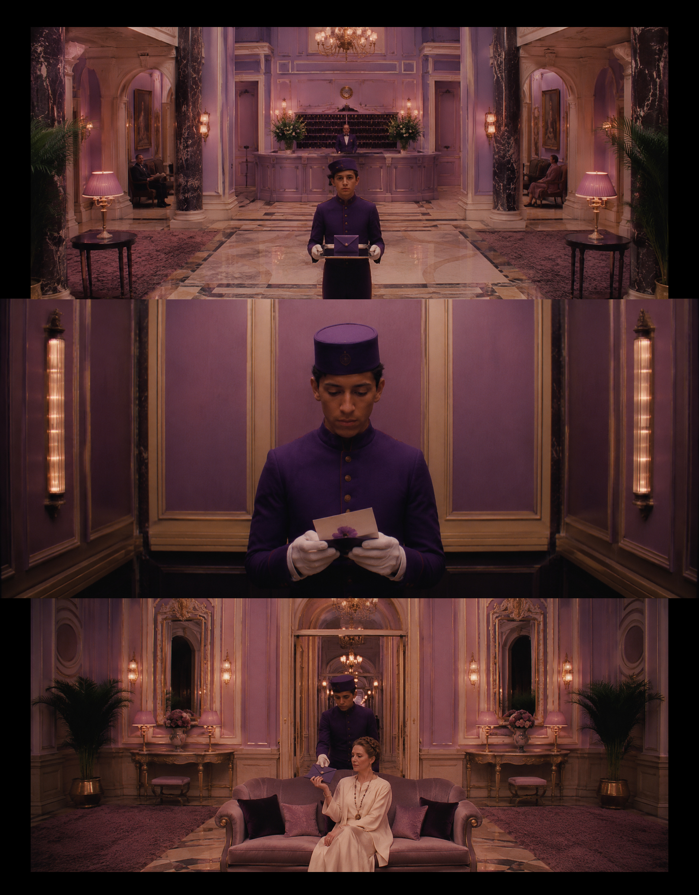
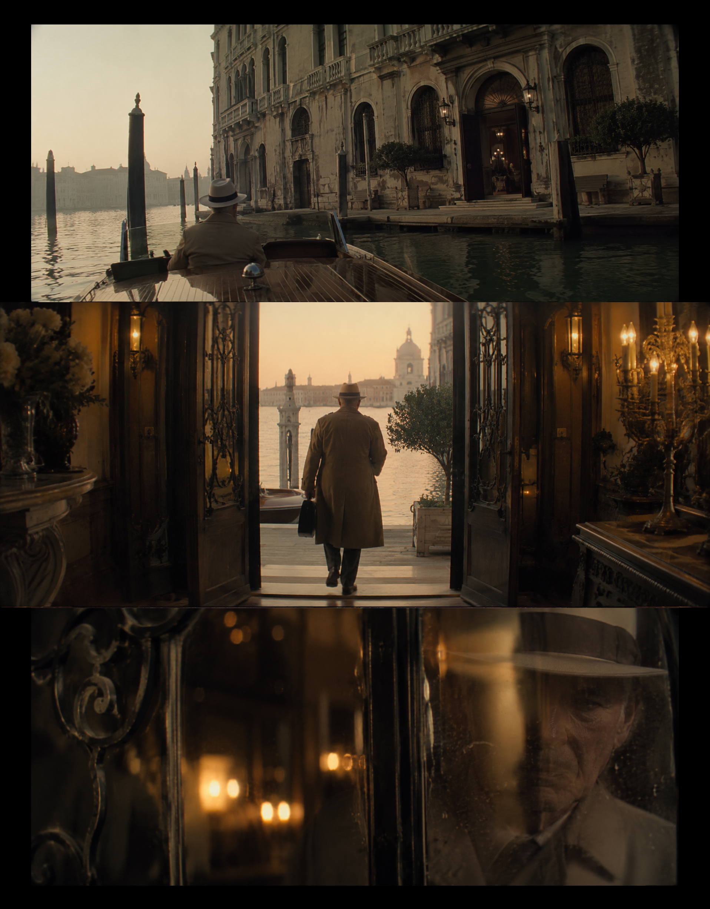
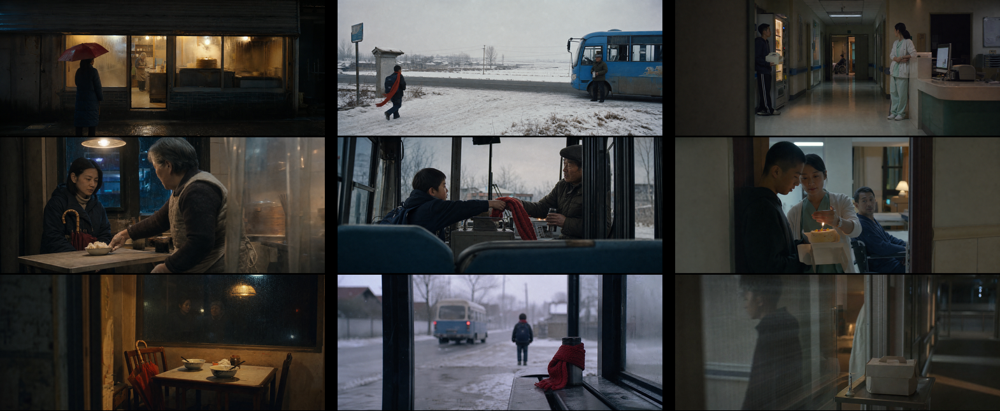

# cinema-dna-21x9x3

一开始我也以为，电影感就是压暗、颗粒、黑边和一句 `cinematic`。

但拆完 300 个电影镜头后，我发现：

真正决定画面像不像电影的，不是滤镜，而是四个判断：

- **镜头：观众站在哪里？**
- **光线：这一刻为什么被照亮？**
- **空间：画面如何从前景走向后景？**
- **叙事：这个瞬间正在发生什么？**

所以这次，我没有继续堆提示词。

而是把这套判断流程写进了 Codex：

```text
任务分析
→ 镜头方案
→ 光线与色彩脚本
→ 空间组织
→ 叙事线索
→ 输出完整生成方案
```

它不会一上来就生成图片，而是先判断这个镜头为什么成立。

这也不是摄影教程，更不是复刻某一部电影。我只是把电影镜头背后的生成逻辑提取出来，重新整理成一套可以反复执行的 AI Skill。

**先判断，再生成。**

## What This Skill Does

`cinema-dna-21x9x3` 是一个 Codex skill，用来把人物、空间、产品、建筑、参考图或简单故事，转换成真实电影感的 21:9 画面生成方案。

默认输出是三张连续叙事镜头：

- **Shot 1 | 建立世界**：交代地点、时间、空间秩序和人物与世界的距离。
- **Shot 2 | 建立关系**：推进事件，让人物、空间和冲突发生关系。
- **Shot 3 | 留下余韵**：减少信息，留下背影、空房间、物件、反射或未完成的动作。

它关注的不是“像电影的滤镜”，而是镜头成立的原因：机位、焦段、光源、空间层次、叙事动作、材质真实感和画面里的未解信息。

## When To Use

适合用于：

- 电影感 AI 图像提示词设计
- 21:9 单帧或三联镜头方案
- 人像、建筑、空间、产品的电影化转译
- 从参考图中提取镜头语言，而不是复刻画面
- 把导演风格拆成具体可执行的视觉语法
- 修正 AI 图常见的广告感、游戏感、CG 感和滤镜感

## Examples

这些示例来自同一套判断流程：不是先套滤镜，而是先确定镜头功能、光源、空间层次和叙事动作。

### Selected Favorites






### Core Examples

### Narrative Overview



### Dumpling Shop Triptych


### Blue Sea And Large Ship


### Eastern Palace Ritual


### Absurd Comedy Timing


## Workflow

这个 skill 会优先完成判断，再输出提示词：

1. 分析任务对象、故事状态和画面目标。
2. 判断镜头功能：建立世界、建立关系，还是留下余韵。
3. 设计机位、焦段、距离、画幅占比和前中后景关系。
4. 确定光源、色彩结构和真实材质。
5. 加入叙事线索，让画面不是静态摆拍。
6. 输出完整的 21:9 生成方案。

## Contents

- `SKILL.md` - main skill instructions
- `references/` - extended cinema grammar and anti-AI film-frame patches
- `agents/` - display metadata
- `examples/` - README example images

## Install

Copy this folder into your Codex skills directory, for example:

```powershell
Copy-Item -Recurse . "$env:USERPROFILE\.codex\skills\cinema-dna-21x9x3"
```
